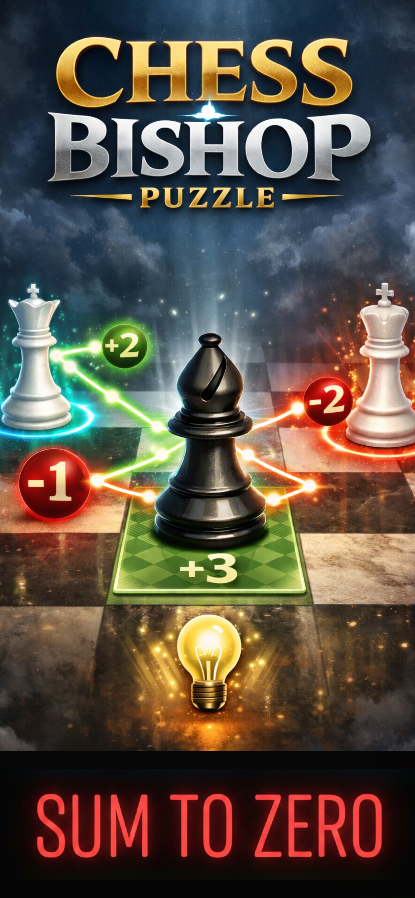

# Chess: Bishop Zero

Step into the ultimate chess-inspired brain challenge. **Chess: Bishop Zero** transforms a single chess piece into a game of precision, strategy, and perfect balance. Every move counts — one misstep, and the path is broken. There’s no luck here, only sharp logic and foresight.

---

## 🧩 Game Highlights

- **Pure Strategy:** Inspired by chess and mathematical logic.  
- **Rules to Master:** Guide the Black Bishop, avoid the White Queen, and capture the White King.  
- **Energy Balance Challenge:** Your total path energy must equal exactly **zero** when capturing the King.  
- **Optional Hints:** Use them to finish a level, but higher difficulties remain locked.  
- **Global Leaderboard:** Compete with players around the world.  
- **Optimized Experience:** Fully designed for both **iPhone** and **iPad**.  
- **Immersive Audio & Visuals:** Clean graphics and satisfying sound effects for every move.

---

## 🎮 Screenshots

|  |

---

## ⚡ Challenge Yourself

Think precisely. Balance to zero. Master the board. **Can you conquer Chess: Bishop Zero?**
